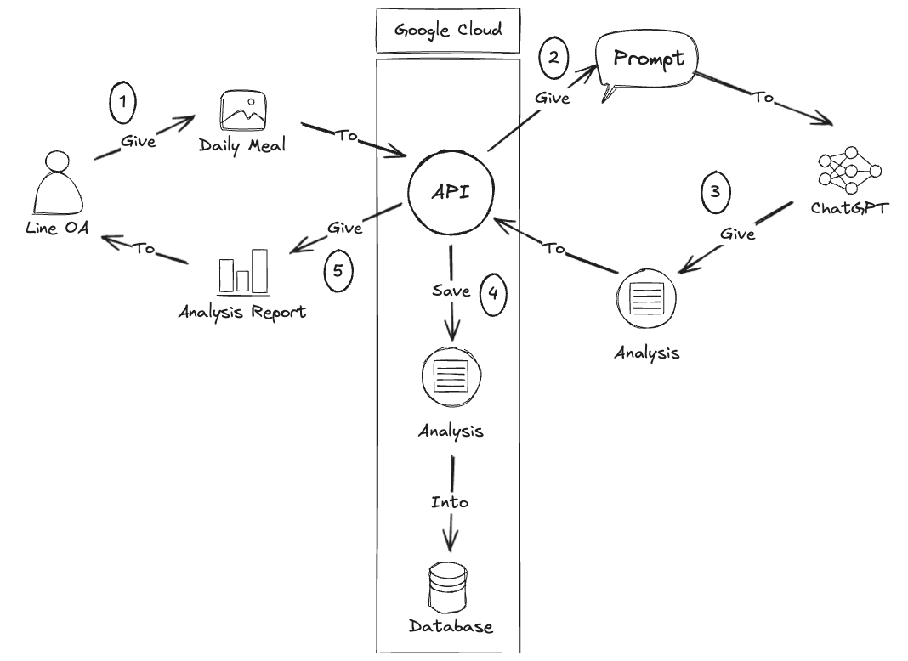
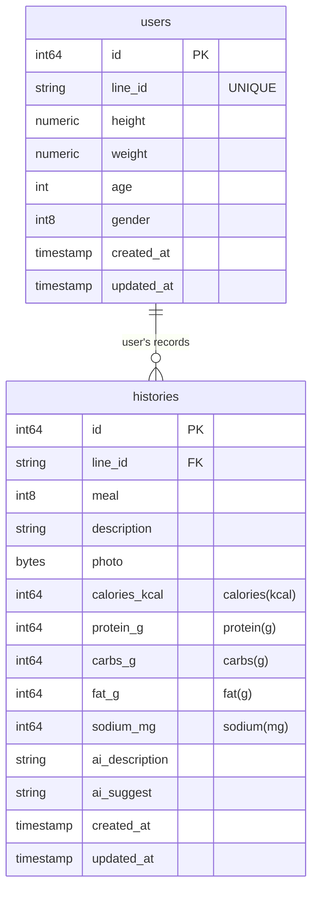
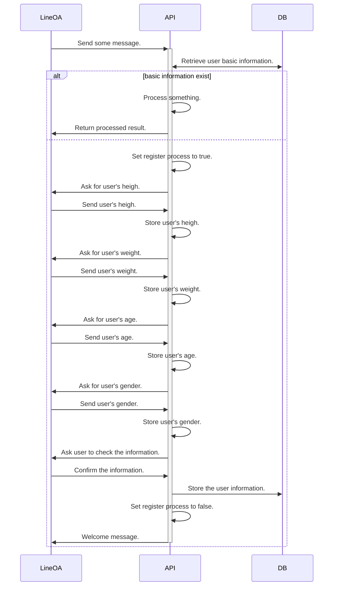
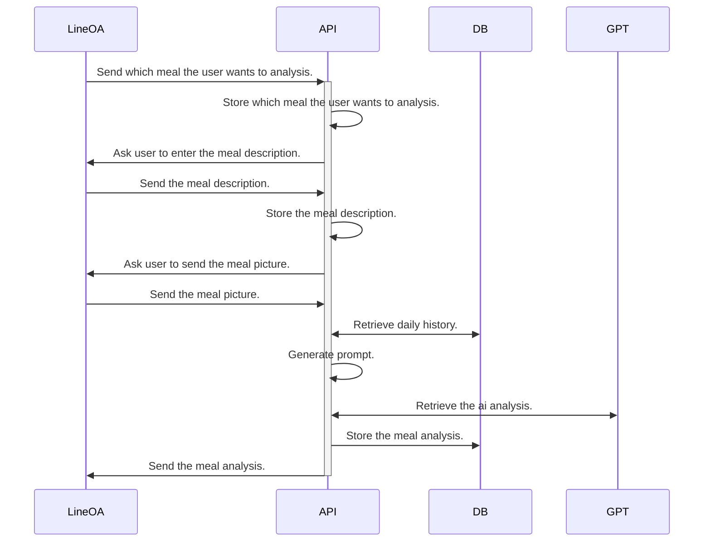
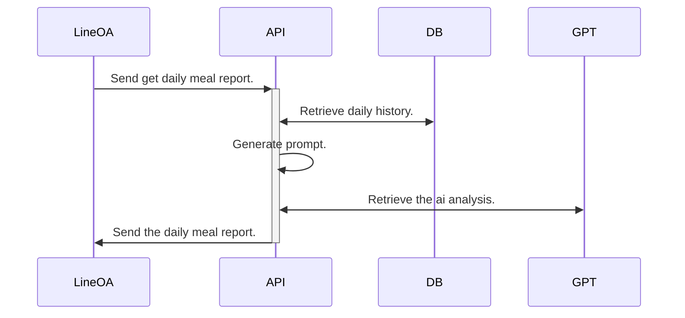
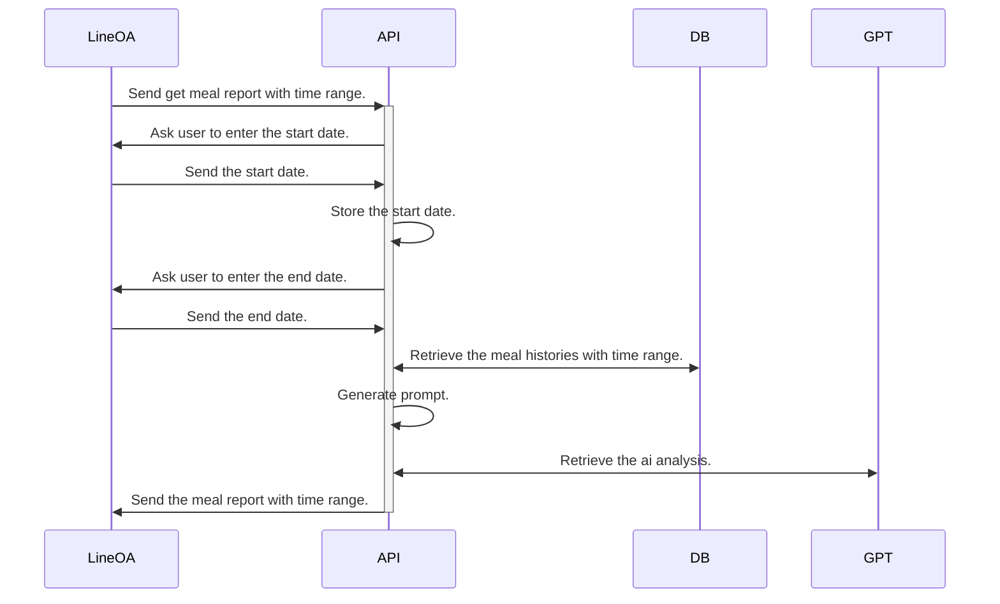

# High Level Design

This is the high level design of the Line OA.

## Architecture

## Schema

## Features

### First use

- User need to give some basic information for the Line OA at the first time.

#### Flow

### Meal Analysis

- User can enter the meal information and retrieve suggestion from AI.

#### Flow

### Get Daily Report

- Users can retrieve the daily meal report which analysis by AI.

#### Flow

### Get Meal Report With Specific Time Range

- Users can retrieve the meal report with specific time range which analysis by AI. The time range is from today to the previous 90 days.

#### Flow

